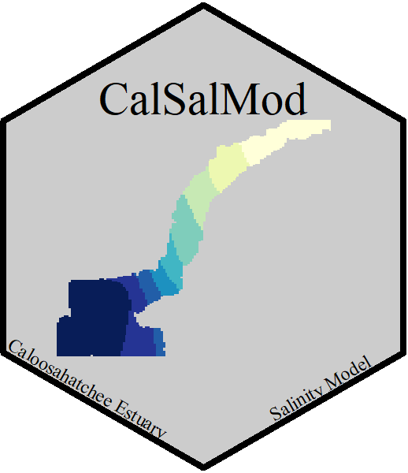

```{r setup, include=FALSE,echo=FALSE}
knitr::opts_chunk$set(echo = TRUE)
knitr::opts_chunk$set(
  collapse = TRUE,
  comment = "#>",
  fig.path = "man/figures/README-"
)
```

# CalSalMod 

[](https://zenodo.org/badge/latestdoi/375684422)

## Table of Contents

* [Introduction](#intro)
* [Citing package](#cite)
* [Installation](#install)

## Introduction <a name="intro"></a>
This package contains equations to estimate salinity within the Caloosahatchee River Estuary consistent with the time-series model presented by Qiu and Wan (2013). The model is a simple 1-D model that takes into account measured freshwater inflow via the S-79 structure and un-gauged discharge from the Caloosahatchee tidal basin. 

Currently this package just includes the simple salinity model, future versions will include forecasting ability and include an autoregressive term representing the system persistence and an exogenous term accounting for physical
drivers. 

    Qiu C, Wan Y (2013) Time series modeling and prediction of 
    salinity in the Caloosahatchee River Estuary. Water Resources 
    Research 49:5804–5816. doi: 10.1002/wrcr.20415


***

Here is an example of the work flow using this package

```{r,message=F,warning=F}
library(AnalystHelper)
library(zoo)
library(reshape2)
library(CalSalMod)

# Data from SFWMD
dates=date.fun(c("2020-05-01","2021-04-30"))

# Rainfall and ET
RF.PET.DBKEY=data.frame(SITE=c("S78W","S79_R"),DBKEY=c("UA637","16414"),param=c("ETPI","RF"))
wx.dat=DBHYDRO_daily(dates[1],dates[2],RF.PET.DBKEY$DBKEY)
wx.dat=merge(wx.dat,RF.PET.DBKEY,"DBKEY")

wx.dat.xtab=dcast(wx.dat,Date~param,value.var="Data.Value",mean)
wx.dat.xtab$RF[wx.dat.xtab$RF<0]=NA; # remove negative values
wx.dat.xtab$ETPI[wx.dat.xtab$ETPI<0]=NA; # remove negative values
wx.dat.xtab$RF_2d=with(wx.dat.xtab,c(NA,rollapply(RF,width=2,function(x)mean(x,na.rm=T))))
wx.dat.xtab$RF_2d[1]=wx.dat.xtab$RF; # replaces first value with 0

wx.dat.xtab$Q.tidebasin=with(wx.dat.xtab,cost_Q(RF_2d,ETPI))

S79Q=DBHYDRO_daily(dates[1],dates[2],"00865")

allQ.dat=merge(wx.dat.xtab[,c("Date","Q.tidebasin")],S79Q[,c("Date","Data.Value")],"Date")
allQ.dat$Q.total=rowSums(allQ.dat[,c("Q.tidebasin","Data.Value")],na.rm=T)

# Modelled salinity at Fort Myers
allQ.dat$mod.sal=SalMod(Q.total=allQ.dat$Q.total,SITE="FtMyers")

# Measured Salinity
params=data.frame(param=c("SPC","WT"),DBKEY=c(88289,88285))
sal.dat=DBHYDRO_daily(dates[1],dates[2],params$DBKEY)
sal.dat=merge(sal.dat,params,"DBKEY")

sal.dat.xtab=dcast(sal.dat,Date~param,value.var="Data.Value",mean)
sal.dat.xtab$WT[sal.dat.xtab$WT<0]=NA
sal.dat.xtab$sal=with(sal.dat.xtab,SalinityCalc(SPC,WT))
```

```{r SalExample,fig.cap="Modeled and Observed Salinity at the Fort Myers Station."}
plot(mod.sal~Date,allQ.dat,type="b",las=1,ylim=c(0,30),ylab="Salinity")
with(sal.dat.xtab,points(Date,sal,pch=21,bg="red"))
mtext(side=3,adj=0,"Site: Ft Myers")
legend("topleft",legend=c("Modelled","Observed"),
       pch=21,pt.bg=c(NA,"red"),ncol=1,cex=0.8,bty="n",y.intersp=1,x.intersp=0.5,xpd=NA,xjust=0.5)

```


## Citing package <a name="cite"></a>

```{r}
citation('CalSalMod')
```


## Installation <a name="install"></a>

Development version can be installed from this repo. 

```{r,eval=F}
install.packages("devtools");# if you do not have it installed on your PC
devtools::install_github("SwampThingPaul/CalSalMod")
```

At this time, this package is still under-development and not available on CRAN.

***
